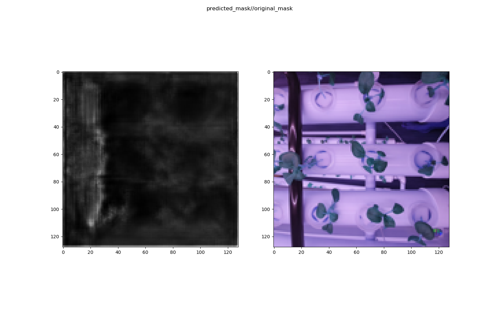

# Image Segmentation for Plant Phenotyping

## Introduction

Goal: Recognise plant leaves from live images and determine plant size and additionally, growth rate. 

This repo contains 2 main technologies for image segmentation:

1. Color thresholding 
2. Deep learning

## Installation

`pip install -r requirements.txt `

## Quick Run

### Color Thresholding

You can run `python color_segmentation_image.py` if you are using photos, or `python color_segmentation_webcam.py` if you want to use your webcam for live feed instead. 

### Deep Learning

Code is largely from this [article](https://medium.com/analytics-vidhya/pytorch-implementation-of-semantic-segmentation-for-single-class-from-scratch-81f96643c98c)

1. Prepare dataset

   Prepare your training dataset and infernce dataset in folders named `train`, `train_masks_png` and `mydata_png`.

   Run `python preprocessing.py`

2. Train model

   Run `python train.py`

3. Model inference

   Run `python infer.py`

## Current Performance

Notice that the model is able to pick out the leaves under light condition similar to the sample dataset (top photo). However, performance drops as lighting is changed, usually to purple as this is the common 'grow light' color. 

Retraining with colour augmentation improved the performance.

For further development, it is important to look at the potential place where you will deploy this and tweak the model accordingly. 

### Future experiments
- Desaturating training dataset to make color less significant
- Adding purple to training dataset
- Removing purple color before inference

## Resources

- https://www.plant-phenotyping.org/datasets-home
- https://github.com/p2irc/deepplantphenomics
- https://realpython.com/python-opencv-color-spaces/
- https://medium.com/analytics-vidhya/pytorch-implementation-of-semantic-segmentation-for-single-class-from-scratch-81f96643c98c
